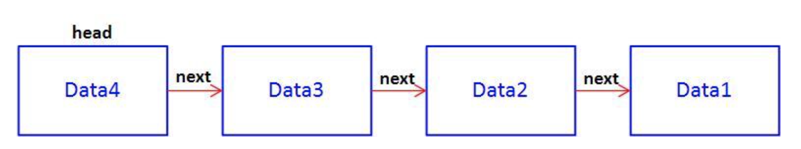
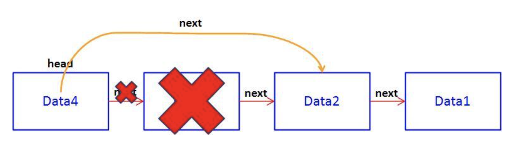

# LinkedList
링크드리스트는 노드의 연결로 구현된 리스트로, 요소를 배열처럼 차례대로 저장하지만, 요소들이 메모리상에 연속적으로 위치하지 않는다는 점이 다르다.  

#### 특징
- 연속되는 항목들이 포인터로 연결된다.
- 마지막 항목은 Null을 가리킨다.
- 프로그램이 수행되는 동안 크기가 커지거나 작아질 수 있다.
- (시스템 메모리가 허용하는 한)필요한 만큼 길어질 수 있다.
- 메모리 공간을 낭비하지 않는다.(하지만 포인터를 위한 추가의 메모리를 필요로 한다.)

#### 장/단점
- 장점: 배열에 비해 데이터의 추가/삽입 및 삭제가 용이하다.(시간복잡도로 보면 아래와같다.)
    - 삽입: O(1) <- 삽입의 시간복잡도가 매우 낮다
    - 삭제: O(N)
    - 헤드삭제: O(1) <- 헤드 삭제의 시간복잡도가 매우 낮다
    - 검색: O(N)
- 단점: 순차적으로 탐색하지 않으면 특정 위치의 요소에 접근할 수 없어 일반적으로 탐색 속도가 떨어진다. <- 검색의 시간복잡도를 보면 O(N)이다.

#### 특징
- 자바스크립트의 배열은 가변적이지만, C나 C++과 같은 언어는 배열은 고정된 크기를 갖고 있기 때문에,  
배열 대신 연결 리스트를 이용하면 실행 시간에 동적으로 메모리를 할당하고 해제할 수 있다는 장점이 있다.

   

- 링크드리스트의 노드는 `데이터`와 `포인터`로 이루어져있는데, `포인터`는 `다음 노드의 주소`를 의미한다.

   

- 링크드리스트 노드의 삭제는 삭제할 노드의 이전 노드의 포인터를 삭제할 노드의 다음 노드의 주소값을 저장하는 형태로 삭제한다.

